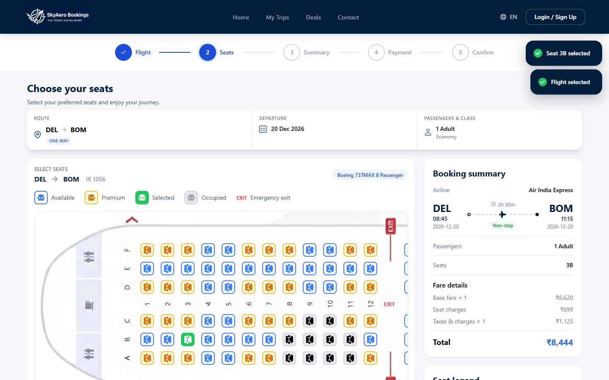
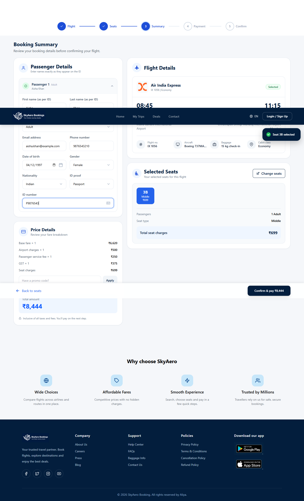
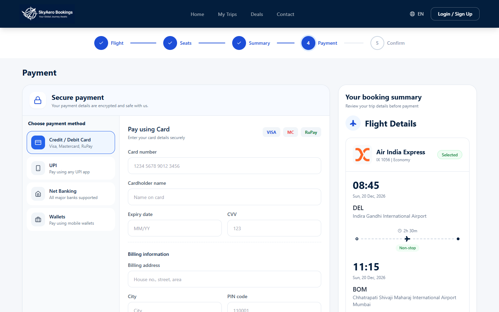
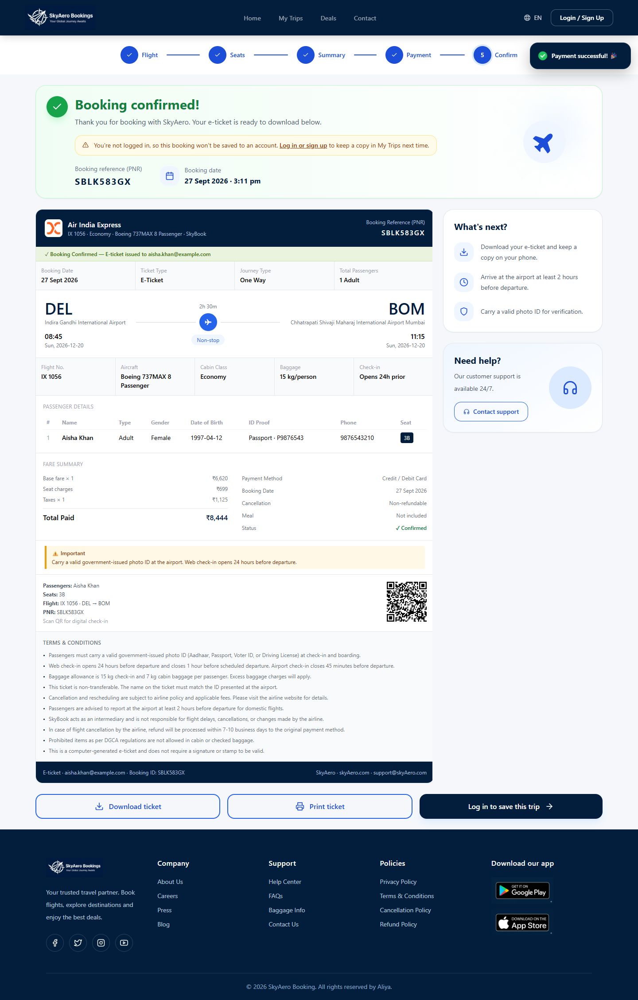

# SkyAero

Flight search and booking app built with React, Vite, Tailwind CSS and Firebase.
Search flights, pick seats, pay (simulated), and manage bookings and e-tickets.

## About

SkyAero is a full flight-booking flow built as a portfolio project: search real flights
(via SerpApi's Google Flights engine), pick seats, enter passenger details, pay through a
mock checkout, and get back a real e-ticket with a PNR and a QR code — all backed by a real
Firebase project for accounts and saved trips. It's built to work the way a real airline
site does end to end, not just as a set of disconnected screens: the same fare that's shown
on the seat map is the one saved to the booking and printed on the ticket, seats you pick
for a round trip's outbound and return legs are tracked independently, and a search a guest
runs without an account still completes and produces a valid ticket.

## Demo

A full run through the app — search, pick a flight, choose a seat, fill in passenger
details, pay, and get back a real e-ticket:


*(recorded against the live deployment, so the flight data and fares are real)*

## Screenshots

| | |
|---|---|
|  |  |
| Home — search form | Search results (live SerpApi data) |
|  |  |
| Seat selection | Booking summary & passenger details |
|  |  |
| Payment | Confirmation & e-ticket |

## Features

- **Flight search** — one-way and round-trip, with airport autocomplete, date validation,
  and up to 9 travellers. A round trip is modeled as two independent one-way searches, so
  outbound and return each get their own real results and their own flight picker.
- **Filtering & sorting** — by price, stops, airline and departure/arrival time window;
  cheapest/fastest/earliest sort options.
- **Seat selection** — an interactive seat map with premium/standard/occupied/exit-row
  states. For a round trip, outbound and return are different aircraft with independent
  seat maps and selections (the same seat number can be picked on both).
- **Passenger details** — one form per traveller, generated from the traveller count, with
  full field validation (name, DOB, gender, nationality, ID proof, contact info).
- **Live fare breakdown** — base fare, seat charges, taxes and promo-code discounts,
  computed the same way on the seat map, the summary, the payment page and the final ticket.
- **Mock payment** — card, UPI (with a generated QR code), net banking and wallet flows,
  with card-number/expiry/CVV validation, a simulated processing state, and a realistic
  decline/retry path (no real card data is ever sent anywhere).
- **Booking confirmation & e-ticket** — a generated PNR, a downloadable/printable e-ticket
  with a QR code, and full details for both legs of a round trip.
- **My Trips** — signed-in users can view upcoming/past bookings, reopen an e-ticket,
  download or print it, and cancel a booking.
- **Accounts** — email/password and Google sign-in via Firebase Auth, with deliberately
  vague auth error messages so the login page can't be used to enumerate registered emails.
- **Deals page** — destination cards with copyable promo codes.
- **Responsive, accessible UI** — usable from a 320px phone up to a large desktop, with
  proper labels, focus states and keyboard navigation throughout.

## Technologies used

**Frontend** — React 19, Vite, React Router, Tailwind CSS, react-hot-toast, react-icons,
react-qr-code.

**Backend / data** — Firebase Authentication, Firebase Firestore (bookings), a Vercel
serverless function (`api/flights.js`) that proxies SerpApi's Google Flights engine so the
API key never reaches the browser.

**Other** — jsPDF + html2canvas (e-ticket PDF export), ESLint, and Vercel for hosting and
deployment.

## Getting started

```bash
yarn install
cp .env.example .env      # then fill in the values (see below)
yarn dev                  # http://localhost:5173
```

| Command        | What it does                                   |
| -------------- | ---------------------------------------------- |
| `yarn dev`     | Dev server (also serves `/api/flights`)        |
| `yarn build`   | Production build into `dist/`                  |
| `yarn preview` | Serve the production build locally             |
| `yarn lint`    | Run ESLint                                     |

## Environment variables

Copy `.env.example` to `.env`. **`.env` is git-ignored: never commit it.**

| Variable                                   | Where it is used | Secret? |
| ------------------------------------------ | ---------------- | ------- |
| `VITE_FIREBASE_API_KEY` and the other `VITE_FIREBASE_*` values | Browser (Firebase Auth + Firestore) | No: public by design. Protect data with Firestore rules and authorized domains. |
| `SERPAPI_KEY`                              | Server only, `api/flights.js` | **Yes** |

Anything prefixed with `VITE_` is bundled into the public JavaScript, so a secret must never use that prefix.
The browser calls our own `/api/flights` endpoint, which adds `SERPAPI_KEY` on the server.

- **Local:** `yarn dev` serves `/api/flights` using the key from `.env`.
- **Vercel:** add the same variables under Project Settings, Environment Variables. `vercel.json` also rewrites all routes to `index.html` so deep links such as `/my-trips` work on refresh.

## Firestore security rules

`saveBooking`/`getUserBookings`/`cancelBooking` (in `src/services/bookingService.js`) trust
Firestore's security rules to stop one signed-in user from reading, cancelling or editing
another user's bookings — the client code itself has no such check. `firestore.rules` in this
repo enforces that: a booking can only be read or cancelled by the `userId` it was created
with, and cancelling can only ever flip `status` to `"cancelled"`, nothing else.

**On pricing:** this app has no payment gateway and no server-side record of a flight's
"real" price — `fare` is computed entirely on the client (`src/hooks/useFare.js`) and saved
as-is. `firestore.rules` rejects a booking whose fare doesn't add up (`grandTotal` must equal
`baseFare + seatTotal + taxes - discount`, nothing negative, discount capped at the largest
promo code), which stops the simplest tampering, but it cannot confirm the numbers match the
flight SerpApi actually quoted — Firestore has no way to see that. A production build that
takes real payments would need a payment webhook or Cloud Function to write the authoritative
charged amount, instead of trusting whatever the client submits.

**This file only takes effect once you deploy it** — copy it into the Firebase console
(Firestore Database → Rules) or run:

```bash
npm install -g firebase-tools   # once
firebase login
firebase use <your-project-id>
firebase deploy --only firestore:rules
```

If your project is still on the default "test mode" rules (`allow read, write: if true;`),
every signed-in — or even anonymous — visitor can read and modify every booking until you
deploy this file.

## Project structure

```
api/                    Serverless functions (Vercel): flights.js proxies SerpApi
src/
  assets/               Images
  components/
    auth/               ProtectedRoute
    booking/            Stepper, PassengerDetails, PaymentMethod, ETicket, ...
    common/             Blocks shared by several pages (FeatureHighlights, WhyChooseUs)
    contact/            ContactSection
    flights/            FlightCard, FlightFilters, FlightOverview, FlightPath, AirportPoint
    home/               Hero, PopularRoutes, OfferBanner, Newsletter
    layout/             Layout, Navbar, Footer
    search/             SearchFlights, SearchSummary, SearchModify
    trips/              TripCard, TripTicket, TripSkeleton
    ui/                 Generic building blocks: PageHero, EmptyState, Field
  config/               env.js: the only place environment variables are read
  constants/            routes, fare, payment labels, trip status
  context/              Auth/Flight/Passenger context objects and providers
  data/                 Static data (seat layout)
  hooks/                useAuth, useFlight, usePassenger, useFare, ...
  pages/                One file per route; pages/booking holds the booking steps
  services/             firebase, bookingService (Firestore), flightService (/api/flights)
  utils/                format, flight, airports, pdf, booking
```

### Conventions

- Components and pages: `PascalCase.jsx`; hooks: `useThing.js`; utilities, constants and services: `camelCase.js`.
- Folders are lowercase. Components are grouped by feature, not by type.
- Every URL comes from `ROUTES` in `src/constants/routes.js`.
- Money, dates and durations are formatted with `src/utils/format.js`; the fare comes from the `useFare` hook.
- Booking steps are `ResultsStep`, `SeatsStep`, `SummaryStep`, `PaymentStep`, `ConfirmationStep`, wired together by `pages/booking/BookingPage.jsx`.

## Notes

- Payment is a simulation: no money moves and no card data leaves the browser.
- The newsletter, deal-alert and contact forms validate input but do not store it yet.
- Checkout doesn't require login. A guest can complete a booking, but it isn't saved anywhere —
  the confirmation page tells them so and links to login instead of My Trips.
- Login/signup errors are deliberately vague about *why* a sign-in failed (wrong email vs. wrong
  password look identical) so the page can't be used to check which emails have an account.
  "Forgot password" always reports success too, for the same reason.
